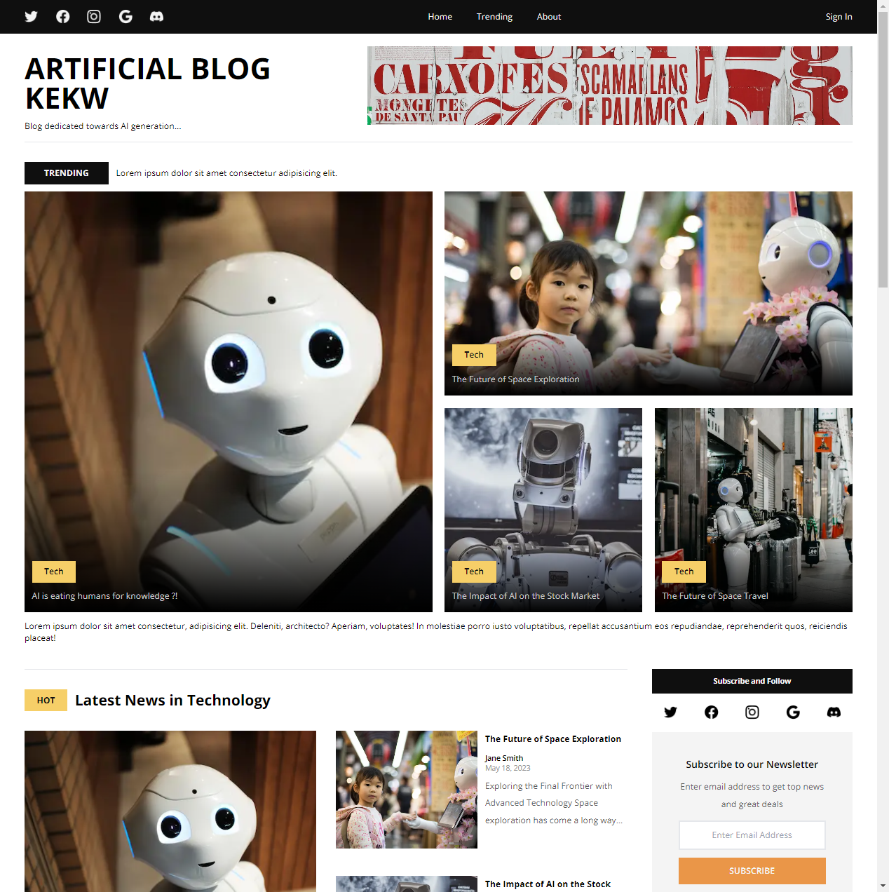
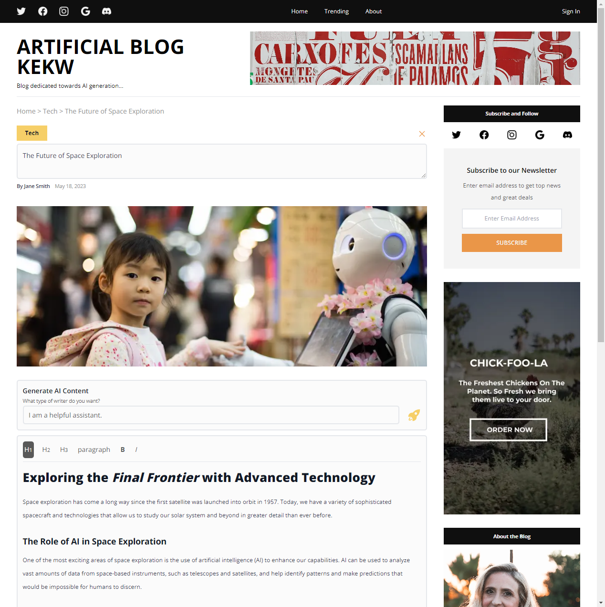

# Next.js blog with AI generated articles

## Features

- header
- two ad widgets, top and right sidebar
- post categories
- post cards used to display and organize on home page
- about author sidebar widget
- subscribe to newsletter widget
- add article
- edit article
- generate article text using openai api
- specify the personality of the generated articles writer
- footer
- responsiveness

## Technologies used

- Next.js
  - frontend framework based on React and Node
- Tiptap Editor
  - headless editor framework used to create/edit articles on article page
- PlanetScale
  - serverlesss MySQL platform used to store articles
- Prisma
  - ORM used to access PlanetScale MySQL db
- Tailwind
  - CSS framework
- OpenAI API
  - used to generate articles

## Application Preview

### Other views

## Credits

Project based on [EdRoh](https://www.youtube.com/@EdRohDev) fullstack tutorial.
